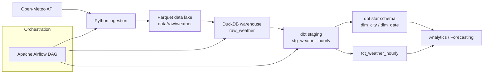
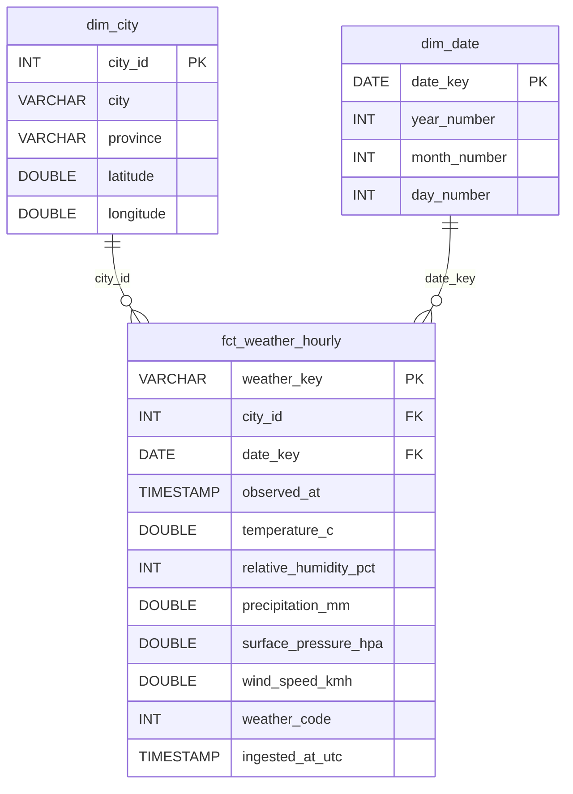
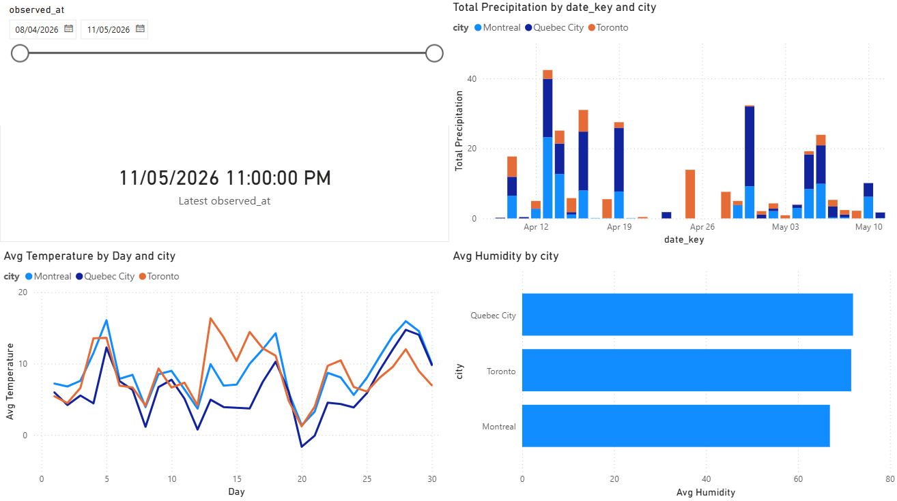

# Canadian Weather Data Pipeline


End-to-end **data engineering pipeline** that ingests weather data from a public API and builds an analytical dataset using a modern data stack.

The project demonstrates how to build a small **data platform locally** using Python, Parquet, DuckDB, dbt and Airflow.

---

# Architecture

```text
Open-Meteo API
      ↓
Python ingestion
      ↓
Parquet data lake (raw)
      ↓
DuckDB warehouse
      ↓
dbt staging models
      ↓
dbt dimensional model (star schema)
      ↓
Power BI dashboard / analytics / forecasting
```

## Pipeline Overview



---

# Stack

| Layer | Technology |
|------|------------|
| Ingestion | Python |
| Data source | Open-Meteo API |
| Data lake | Parquet |
| Warehouse | DuckDB |
| Transformation | dbt |
| Orchestration | Apache Airflow |
| Data Quality | dbt tests + Python validation |
| Analytics | Power BI dashboard / Python |

---

# Environment Variables

The project uses environment variables to support execution in different environments:

- Windows
- WSL / Linux
- Airflow

The DuckDB path used by dbt is configured using the variable:

```text
DBT_DUCKDB_PATH
$env:DBT_DUCKDB_PATH="C:\dev\canadian-weather-data-pipeline\data\warehouse\weather.duckdb"
```

This allows the same profiles.yml configuration to work in all environments.

---

# Project Structure

```text
canadian-weather-data-pipeline
│
├─ airflow
│  └─ dags
│     └─ weather_pipeline_dag.py
│
├─ data
│  ├─ raw
│  │  └─ weather
│  │     └─ *.parquet
│  │
│  └─ warehouse
│     └─ weather.duckdb
│
├─ src
│  ├─ config.py
│  ├─ ingest_weather_api.py
│  └─ load_duckdb.py
│
├─ dbt_weather
│  ├─ models
│  │  ├─ staging
│  │  │   ├─ stg_weather_hourly.sql
│  │  │   └─ staging.yml
│  │  │
│  │  └─ marts
│  │      ├─ dim_city.sql
│  │      ├─ dim_date.sql
│  │      ├─ fct_weather_hourly.sql
│  │      └─ marts.yml
│  │
│  ├─ dbt_project.yml
│  └─ profiles.yml
│
├─ test
│  ├─ check_ingestion.py
│  └─ check_duckdb_load.py
│
├─ analytics
│   └─ weather_dashboard.pbix
|
├─ notebooks
├─ requirements.txt
└─ README.md
```

---

# Data Source

Weather data is retrieved from:

**Open-Meteo API**

https://open-meteo.com/

The pipeline currently collects hourly data for several Canadian cities including:

- Montreal
- Quebec City
- Toronto

Variables collected:

- temperature
- humidity
- precipitation
- wind speed
- surface pressure
- weather code

---

# Data Model

The analytical layer uses a **star schema** built with dbt.

## Dimension Tables

| Table | Description |
|------|-------------|
| `dim_city` | List of cities with geographic metadata (city, province, latitude, longitude) |
| `dim_date` | Calendar dimension used for time-based analysis |

## Fact Table

| Table | Description |
|------|-------------|
| `fct_weather_hourly` | Hourly weather observations including temperature, humidity, precipitation and wind speed |

## Star Schema



The fact table `fct_weather_hourly` is implemented as an **incremental dbt model**.

This allows the pipeline to efficiently process new weather data while updating recent forecasts when predictions change.

The model is validated using dbt data quality tests including:

- uniqueness constraints
- not-null constraints
- referential integrity between fact and dimension tables
- domain validation for meteorological variables (temperature and humidity ranges)

---

# Airflow

## Workflow Orchestration

The pipeline is orchestrated with **Apache Airflow**.

Airflow executes the pipeline as a Directed Acyclic Graph (DAG) composed of three tasks:

```text
ingest_weather_api
        ↓
load_duckdb
        ↓
dbt_build
```

DAG implementation
```text
airflow/
└── dags/
    └── weather_pipeline_dag.py
```

Each task is executed using Airflow BashOperator:

API ingestion

Runs:

python src/ingest_weather_api.py

Warehouse loading

Runs:

python src/load_duckdb.py

Transformation layer

Runs:

dbt build (models + data quality tests)

Running the pipeline

The pipeline can be triggered from the Airflow UI:

http://localhost:8080

or manually via CLI:

airflow dags trigger weather_pipeline

## Running Airflow (Windows)

Apache Airflow runs in a Linux environment.  
On Windows, the recommended approach is to use **WSL2 (Windows Subsystem for Linux)**.

Open PowerShell and run:

```powershell
wsl --install
wsl --install -d Ubuntu-22.04
```

Restart Windows if required.

```powershell
wsl
cd /mnt/c/dev/canadian-weather-data-pipeline
source airflow_venv/bin/activate
export AIRFLOW_HOME=~/airflow
airflow standalone
```

Open in a browser: http://localhost:8080

Enable the DAG weather_pipeline and click Trigger DAG

---

# Example Pipeline Run

Step 1 — API ingestion

Running the ingestion script generates a raw dataset stored in Parquet.

Example file:

data/raw/weather/weather_hourly_20260408T142500Z.parquet

Example rows:

city	time	temperature	precipitation
Montreal	2026-04-08 10:00	4.5	0.0
Montreal	2026-04-08 11:00	5.1	0.0

Step 2 — Load into DuckDB

The raw Parquet files are loaded into a local DuckDB database.

Database file:

data/warehouse/weather.duckdb

Main table created:

raw_weather

Example query:

SELECT city, time, temperature_2m, precipitation
FROM raw_weather
ORDER BY city, time
LIMIT 10;

Step 3 — dbt transformations

Running dbt builds the dimensional model:

stg_weather_hourly
dim_city
dim_date
fct_weather_hourly

---

# Tests

The project includes multiple layers of validation.

### Python validation

Example scripts:

test/check_ingestion.py
test/check_duckdb_load.py

These tests verify:

- API response structure
- parquet dataset creation
- successful DuckDB load
- dataset schema integrity

### dbt data quality tests

dbt tests are executed automatically as part of the pipeline using:

dbt build

Implemented checks include:

- uniqueness constraints
- not-null constraints
- referential integrity
- meteorological domain validation (temperature and humidity ranges)

These tests help ensure data consistency and reliability in the analytical layer.

---

# Analytics Dashboard

The analytical dataset can be explored using a **Power BI dashboard** built on the DuckDB star schema.

Dashboard file:

analytics/weather_dashboard.pbix



The dashboard connects to the DuckDB warehouse in **read-only mode** and provides visualizations such as:

- hourly temperature trends
- precipitation by city
- humidity comparison between cities
- short-term weather forecast analysis

This layer demonstrates how the data engineering pipeline feeds a BI tool for analytics and visualization.

---

# Roadmap

Roadmap

Planned improvements:

- weather forecasting model
- automated data quality monitoring