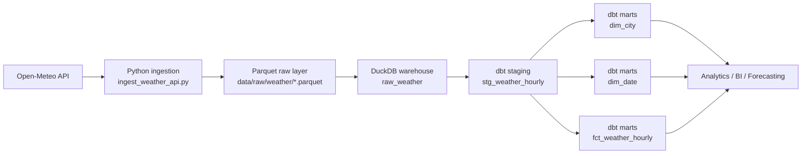
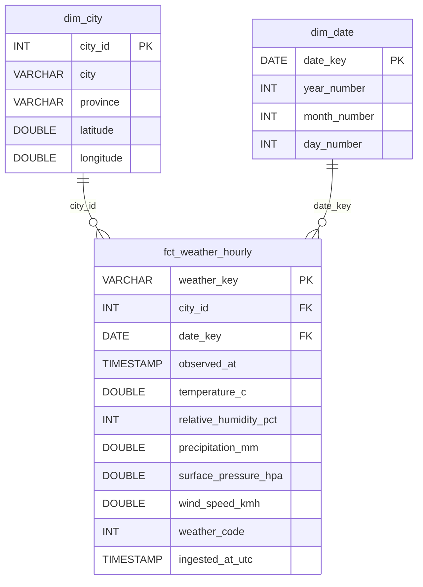

# Canadian Weather Data Pipeline


End-to-end **data engineering pipeline** that ingests weather data from a public API and builds an analytical dataset using a modern data stack.

The project demonstrates how to build a small **data platform locally** using Python, Parquet, DuckDB, dbt and Airflow.

---

# Architecture

```text
Open-Meteo API
      ↓
Python ingestion
      ↓
Parquet data lake (raw)
      ↓
dbt staging models
      ↓
dbt dimensional model
      ↓
Analytics / dashboards / forecasting
```

## Pipeline Overview



---

# Stack

| Layer | Technology |
|-----|-----|
| Ingestion | Python |
| Data source | Open-Meteo API |
| Data lake | Parquet |
| Warehouse | DuckDB |
| Transformation | dbt |
| Orchestration | Airflow |
| Validation | Python tests |

---

# Project Structure

```text
canadian-weather-data-pipeline
│
├─ data
│ ├─ raw
│ │ └─ weather
│ │      └─ weather_hourly_YYYYMMDDTHHMMSS.parquet
│ └─ warehouse
│     └─ weather.duckdb
│
├─ src
│ ├─ config.py
│ ├─ ingest_weather_api.py
│ └─ load_duckdb.py
│
├─ dbt_weather
│  ├─ models
│  │  ├─ staging
│  │  │   ├─ stg_weather_hourly.sql
│  │  │   └─ staging.yml
│  │  │
│  │  └─ marts
│  │      ├─ dim_city.sql
│  │      ├─ dim_date.sql
│  │      ├─ fct_weather_hourly.sql
│  │      └─ marts.yml
│  │
│  └─ dbt_project.yml
│
├─ test
│ └─ check_ingestion.py
│ └─ check_duckdb_load.py
│
├─ notebooks
│
├─ requirements.txt
└─ README.md
```

---

# Data Source

Weather data is retrieved from:

**Open-Meteo API**

https://open-meteo.com/

The pipeline currently collects hourly data for several Canadian cities including:

- Montreal
- Quebec City
- Toronto

Variables collected:

- temperature
- humidity
- precipitation
- wind speed
- surface pressure
- weather code

---

# Data Model

The analytical layer uses a **star schema** built with dbt.

## Dimension Tables

| Table | Description |
|------|-------------|
| `dim_city` | List of cities with geographic metadata (city, province, latitude, longitude) |
| `dim_date` | Calendar dimension used for time-based analysis |

## Fact Table

| Table | Description |
|------|-------------|
| `fct_weather_hourly` | Hourly weather observations including temperature, humidity, precipitation and wind speed |

## Star Schema



---

# Example Pipeline Run

Step 1 — API ingestion

Running the ingestion script generates a raw dataset stored in Parquet.

Example file:

data/raw/weather/weather_hourly_20260408T142500Z.parquet

Example rows:

city	time	temperature	precipitation
Montreal	2026-04-08 10:00	4.5	0.0
Montreal	2026-04-08 11:00	5.1	0.0

Step 2 — Load into DuckDB

The raw Parquet files are loaded into a local DuckDB database.

Database file:

data/warehouse/weather.duckdb

Main table created:

raw_weather

Example query:

SELECT city, time, temperature_2m, precipitation
FROM raw_weather
ORDER BY city, time
LIMIT 10;

Step 3 — dbt transformations

Running dbt builds the dimensional model:

stg_weather_hourly
dim_city
dim_date
fct_weather_hourly

---

# Tests

The project includes validation tests.

Example tests:

test/check_ingestion.py
test/check_duckdb_load.py

Tests verify:

API response structure
parquet dataset creation
successful DuckDB load
dataset schema integrity

dbt tests

Examples:

uniqueness tests
not-null constraints
referential integrity between fact and dimension tables

---

# Roadmap

Roadmap

Planned improvements:

- Airflow orchestration
- incremental dbt models
- weather analytics dashboard
- demand forecasting model